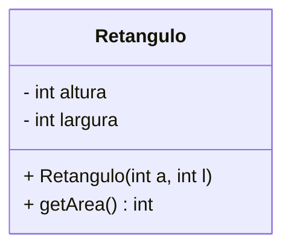
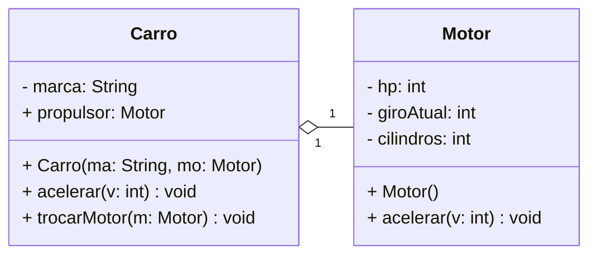
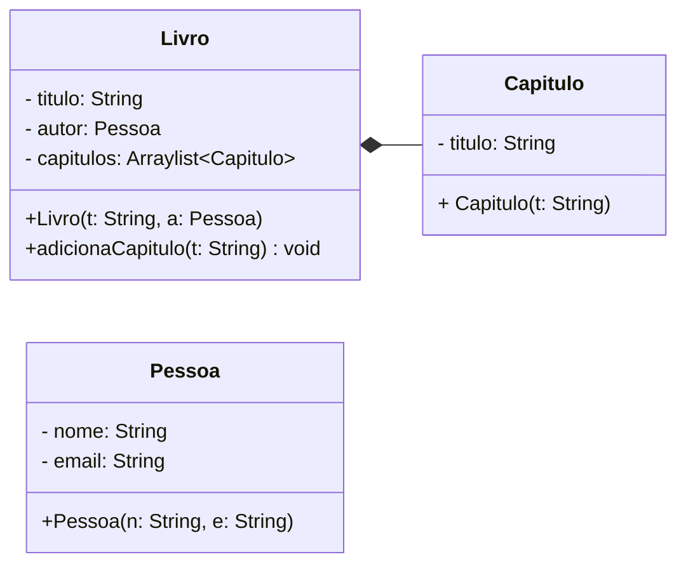

# Diagrama de classes UML

```mermaid
classDiagram
    
    class Retangulo{
        - int altura
        - int largura
        + Retangulo (int a, int l)
        + getArea() int
    }
```
### Associação por Agregação

```mermaid
classDiagram
    direction LR
    Carro "1" o-- "1" Motor
    
    class Carro{
        - marca: String
        + propulsor: Motor
        + Carro(ma: String, mo: Motor)
        + acelerar(v: int) void
        + trocarMotor(m: Motor) void
    }
    
    class Motor{
        - hp: int
        - giroAtual: int
        - cilindros: int
        + Motor()
        + acelerar(v: int) void
    }
```
### Associação por Composição

```mermaid
classDiagram
    direction LR
    
    Livro *-- Capitulo
    
    class Livro{
        - titulo: String 
        - autor: Pessoa
        - capitulos: Arraylist~Capitulo~
        +Livro(t: String, a: Pessoa)
        +adicionaCapitulo(t: String) void
    }
    
    class Capitulo{
        - titulo: String
        + Capitulo(t: String)
    }
    
    class Pessoa{
        - nome: String
        - email: String
        +Pessoa(n: String, e: String)
    }
```