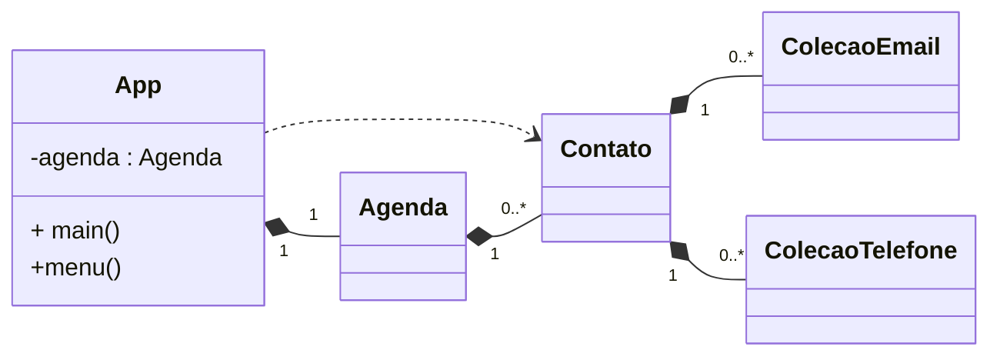

```mermaid
classDiagram
    direction LR
    App "1" *-- "1" Agenda
    App ..> Contato
    Agenda "1" *-- "0..*" Contato
    Contato "1" *-- "0..*" ColecaoEmail
    Contato "1" *-- "0..*" ColecaoTelefone
    
    class App{
        -agenda : Agenda
        + main()
        +menu()
    }
    
    class Agenda{
        
    }
    
    class Contato{
        
    }
    
    class ColecaoEmail{
        
    }
    
    class ColecaoTelefone{
        
    }

```