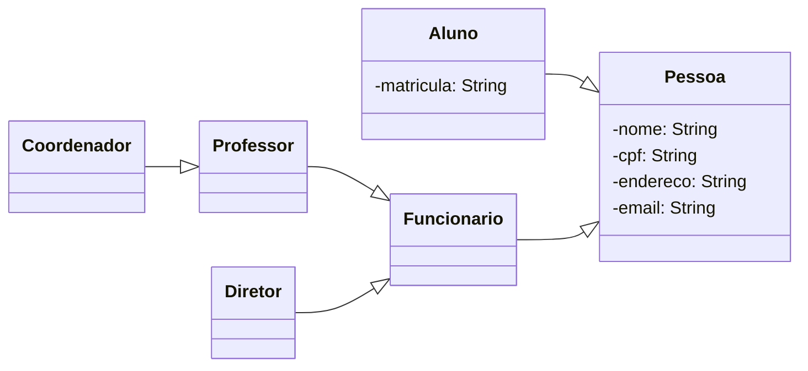
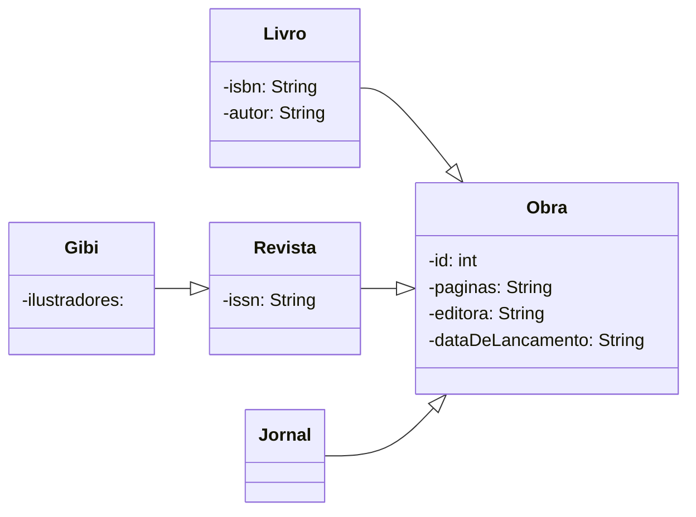

```mermaid
classDiagram
    direction LR
    
    Aluno --|> Pessoa
    Professor --|> Funcionario
    Coordenador --|> Professor
    Diretor --|> Funcionario
    Funcionario --|> Pessoa
    
    
    class Pessoa{
        -nome: String
        -cpf: String
        -endereco: String
        -email: String
    }
    
    class Funcionario{
        
    }
    
    class Aluno{
        -matricula: String
    }
    
    class Professor{
        
    }
    
    class Coordenador{
        
    }
    
    class Diretor{
        
    }

```

```mermaid
classDiagram
    direction LR
    
    Gibi --|> Revista
    Livro --|> Obra
    Revista --|> Obra
    Jornal --|> Obra
    
    class Obra{
        -id: int
        -paginas: String
        -editora: String
        -dataDeLancamento: String
    }
    
    class Livro{
        -isbn: String
        -autor: String
    }
    
    class Revista{
        -issn: String
    }
    
    class Jornal{
        
    }
    
    class Gibi{
        -ilustradores:
    }
    
```

```mermaid
classDiagram
    direction LR
```