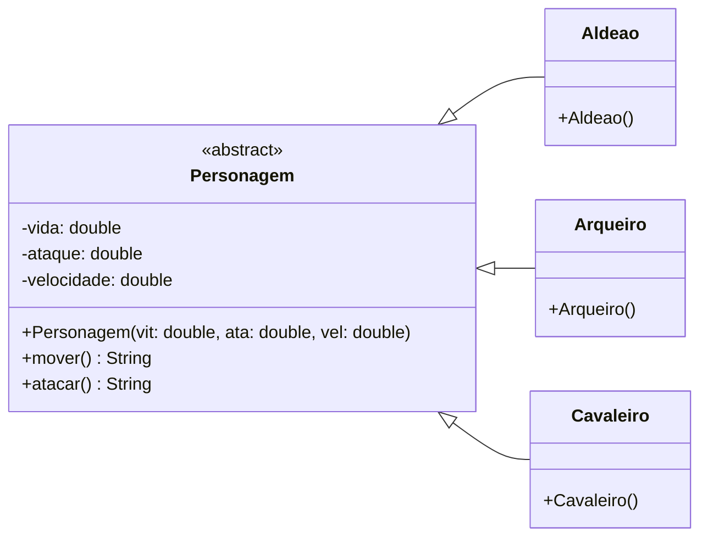

```mermaid
classDiagram
    direction LR
    
    Personagem <|-- Aldeao
    Personagem <|-- Arqueiro
    Personagem <|-- Cavaleiro
    
    
    class Personagem{
        <<abstract>>
        -vida: double
        -ataque: double
        -velocidade: double
        
        +Personagem(vit: double, ata: double, vel: double)
        +mover() String
        +atacar() String
    }
    
    class Aldeao{
        +Aldeao()
    }
    
    class Arqueiro{
        +Arqueiro()
    }
    
    class Cavaleiro{
        +Cavaleiro()
    }
```