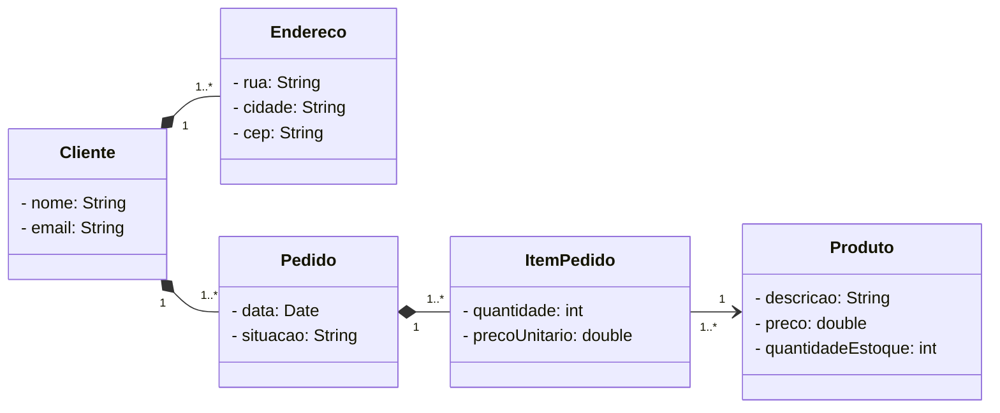

```mermaid
classDiagram
    direction LR

    Cliente "1" *-- "1..*" Endereco
    Cliente "1" *-- "1..*" Pedido
    Pedido "1" *-- "1..*" ItemPedido
    ItemPedido "1..*" --> "1" Produto

    class Cliente {
        - nome: String
        - email: String
    }

    class Endereco {
        - rua: String
        - cidade: String
        - cep: String
    }

    class Pedido {
        - data: Date
        - situacao: String
    }

    class ItemPedido {
        - quantidade: int
        - precoUnitario: double
    }

    class Produto {
        - descricao: String
        - preco: double
        - quantidadeEstoque: int
    }

```
