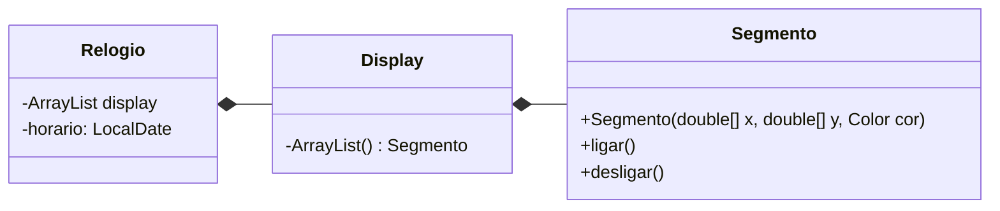

```mermaid
classDiagram
    direction LR
    
    Display *-- Segmento
    Relogio *-- Display
    
    class Relogio{
        -ArrayList<Display> display
        -horario: LocalDate
    }
    
    class Display{
        -ArrayList()Segmento
    }
    
    class Segmento{
        +Segmento(double[] x, double[] y, Color cor)
        +ligar()
        +desligar()
    }
```