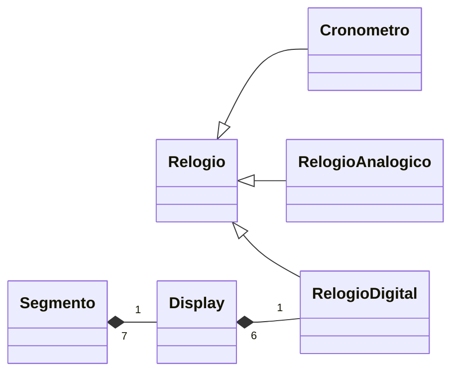

```mermaid
classDiagram
    direction LR
    
    Relogio <|-- RelogioDigital
    Relogio <|-- RelogioAnalogico
    Relogio <|-- Cronometro
    
    Display "6" *-- "1" RelogioDigital
    Segmento "7" *-- "1" Display

    class Relogio{

    }
    
    class Cronometro{
        
    }
    
    class RelogioAnalogico{
        
    }
    
    class RelogioDigital{
        
    }
    
    class Display{
        
    }
    
    class Segmento{
        
    }
```