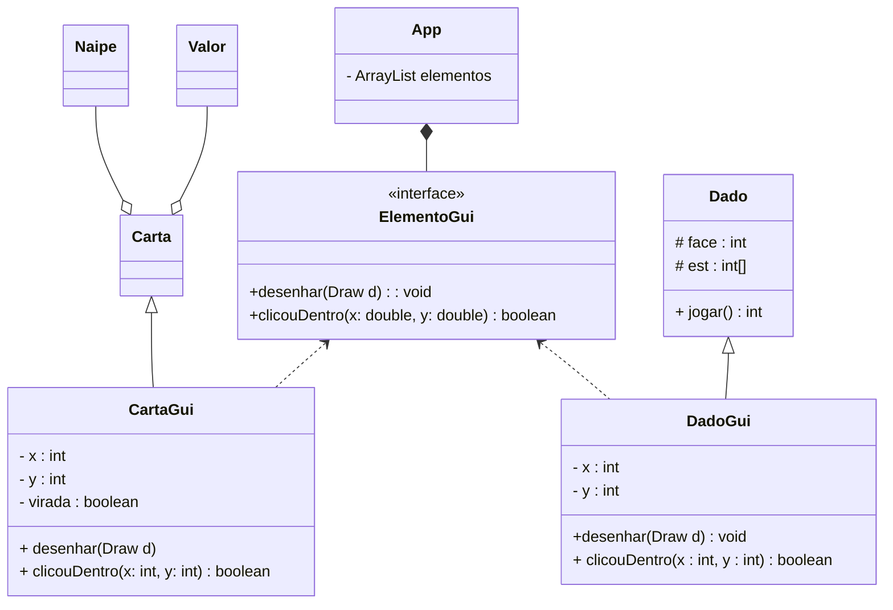

```mermaid
classDiagram
    direction TB
    
    App *-- ElementoGui
    Carta <|-- CartaGui
    Naipe --o Carta
    Valor --o Carta
    Dado <|-- DadoGui
    
    ElementoGui <.. CartaGui
    ElementoGui <.. DadoGui
    
    class App{
        - ArrayList<???> elementos
    }
    
    class Dado{
        # face : int
        # est : int[]
        + jogar() int
    }
    
    class DadoGui{
        - x : int 
        - y : int
        +desenhar(Draw d) void
        + clicouDentro(x : int, y : int) boolean
    }
    
    class CartaGui{
        - x : int
        - y : int
        - virada : boolean
        + desenhar (Draw d)
        + clicouDentro(x: int, y: int) boolean
    }
    
    class ElementoGui{
        <<interface>>
        +desenhar(Draw d): void
        +clicouDentro(x: double, y: double) boolean
    }
    
```